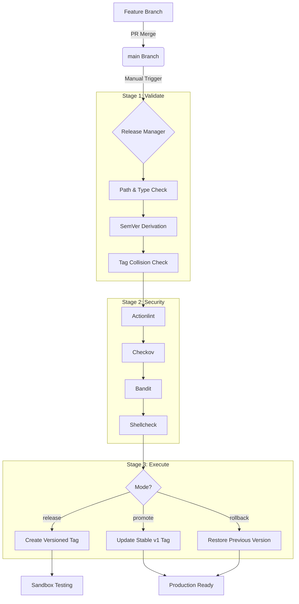

# Monorepo Release Management

This repository implements a robust and secure release management lifecycle for GitHub Actions and Reusable Workflows, aligned with **OWASP SPVS (Secure Pipeline Verification Standard) 1.0**.

## Architecture Overview

The system is designed as a three-stage pipeline (Validate, Security, Execute) that manages the lifecycle of components from a feature branch merge to a stable production release.

## Release Lifecycle

### 1. Release (Sandbox)
- **Trigger**: Run the `Release Manager` workflow with `mode: release`.
- **Behavior**: 
    - Automatically derives the next version based on commit history.
    - Performs full security scans.
    - Creates a versioned tag (e.g., `janitor-bot-1.0.0`).
    - For workflows, it automatically syncs the file to `.github/workflows/`.
- **Purpose**: Provides a versioned artifact for testing in sandbox environments.

### 2. Promote (Production)
- **Trigger**: Run the `Release Manager` workflow with `mode: promote`.
- **Behavior**:
    - Skips security scans (assumes they passed during release).
    - Updates the stable tag (e.g., `janitor-bot-v1`) to point to the selected versioned tag.
    - Uses a secure "delete-and-recreate" approach for tags (no force-push).
- **Purpose**: Marks a specific version as the stable production release.

### 3. Rollback
- **Trigger**: Run the `Release Manager` workflow with `mode: rollback`.
- **Behavior**:
    - Identifies the previous versioned tag in the history.
    - Updates the stable tag (`v1`) to point to that previous version.
    - For workflows, it restores the previous version of the file in `.github/workflows/` on the `main` branch.
- **Purpose**: Quickly reverts to a known good state in case of production issues.

## Commit Message Format

Every commit subject must start with a **ticket reference**, followed by a **Conventional Commit** keyword. This is enforced locally via the `commit-msg` pre-commit hook and drives **SemVer** in the Release Manager.

### Ticket prefix (required)

| Pattern | Example |
| :--- | :--- |
| `sctask<number>` | `sctask9876543 feat: add cleanup rule` |
| `inc<number>` | `INC0012345 fix: resolve null pointer` |
| `DCDT-<number>` | `DCDT-12345 chore: update dependencies` |

Ticket matching is case-insensitive (`SCTASK`, `inc`, `dcdt-` are all valid). An optional colon may follow the ticket (`DCDT-1234: feat ...`).

### Subject formats (four supported patterns)

| # | Format | Example |
| :--- | :--- | :--- |
| 1 | `TICKET keyword(scope): message` | `DCDT-1234 feat(release): add hook` |
| 2 | `TICKET: keyword(scope) message` | `SCTASK99: fix(janitor) correct path` |
| 3 | `TICKET: keyword() message` | `INC42: feat() add capability` |
| 4 | `TICKET keyword(): message` | `DCDT-1234 fix(): resolve null pointer` |

Scope is optional in all patterns (`keyword:` and `keyword()` are valid).

### Standard keywords (required after ticket)

| Keyword | Definition | SemVer bump |
| :--- | :--- | :--- |
| `feat` | A new feature for the user or the codebase. | **Minor** |
| `fix` | A bug fix. | **Patch** |
| `chore` | Changes that do not affect source or test files (e.g. dependencies, build process). | **Patch** |
| `docs` | Changes to documentation only. | **None** |
| `refactor` | Code changes that neither fix a bug nor add a feature. | **None** |
| `perf` | Code changes that improve performance. | **None** |
| `test` | Adding missing tests or correcting existing tests. | **None** |
| `style` | Changes that do not affect code meaning (whitespace, formatting, etc.). | **None** |

> **Note**: If no `feat`, `fix`, or `chore` commits exist since the last tag, release fails to prevent empty version bumps. Merge commits (`Merge branch ...`) are exempt from the hook.

## Security Guardrails

Every release undergoes a comprehensive suite of security scans:
- **Actionlint**: Validates GitHub Actions workflow syntax.
- **Checkov**: Scans for security misconfigurations in Actions and Workflows.
- **Bandit**: Performs static analysis for security issues in Python code.
- **Shellcheck**: Identifies bugs and security risks in shell scripts.

## Prerequisites

1. **GitHub App**: A GitHub App must be configured with `contents: write` and `workflows: write` permissions.
2. **Secrets**: The following secrets must be added to the repository:
    - `RELEASE_APP_ID`: The Client ID of the GitHub App.
    - `RELEASE_APP_PRIVATE_KEY`: The private key of the GitHub App.
3. **Branch Protection**: If the `main` branch is protected, the GitHub App must be added to the **"Allow bypass"** list to enable automated workflow syncing.
