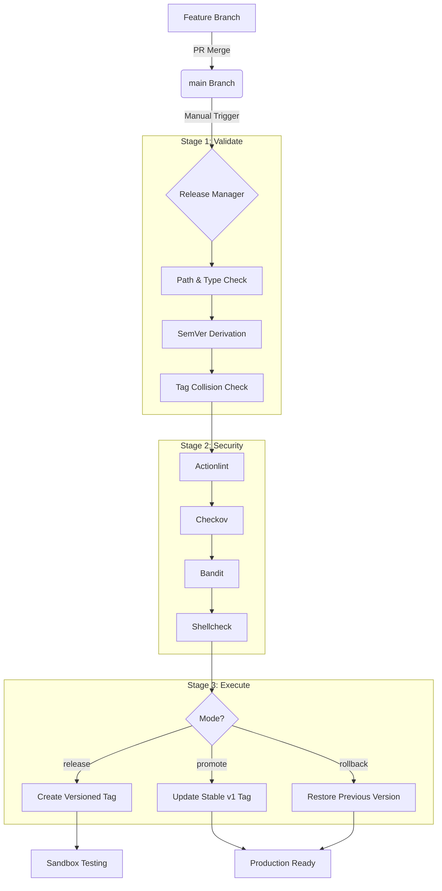

# Monorepo Release Management

This repository implements a robust and secure release management lifecycle for GitHub Actions and Reusable Workflows, aligned with **OWASP SPVS (Secure Pipeline Verification Standard) 1.0**.

## Architecture Overview

The system is designed as a three-stage pipeline (Validate, Security, Execute) that manages the lifecycle of components from a feature branch merge to a stable production release.

## Release Lifecycle

### 1. Release (Sandbox)
- **Trigger**: Run the `Release Manager` workflow with `mode: release`.
- **Behavior**: 
    - Automatically derives the next version based on commit history.
    - Performs full security scans.
    - Creates a versioned tag (e.g., `janitor-bot-1.0.0`).
    - For workflows, it automatically syncs the file to `.github/workflows/`.
- **Purpose**: Provides a versioned artifact for testing in sandbox environments.

### 2. Promote (Production)
- **Trigger**: Run the `Release Manager` workflow with `mode: promote`.
- **Behavior**:
    - Skips security scans (assumes they passed during release).
    - Updates the stable tag (e.g., `janitor-bot-v1`) to point to the selected versioned tag.
    - Uses a secure "delete-and-recreate" approach for tags (no force-push).
- **Purpose**: Marks a specific version as the stable production release.

### 3. Rollback
- **Trigger**: Run the `Release Manager` workflow with `mode: rollback`.
- **Behavior**:
    - Identifies the previous versioned tag in the history.
    - Updates the stable tag (`v1`) to point to that previous version.
    - For workflows, it restores the previous version of the file in `.github/workflows/` on the `main` branch.
- **Purpose**: Quickly reverts to a known good state in case of production issues.

## Commit Message Format

The system uses **Conventional Commits** to automatically determine the next semantic version. Versioning starts at `1.0.0` by default.

| Prefix | Bump Type | Example |
| :--- | :--- | :--- |
| `feat:` or `feat(...):` | **Minor** | `feat: add new cleanup rule` (1.0.0 -> 1.1.0) |
| `fix:` or `fix(...):` | **Patch** | `fix: resolve null pointer in janitor` (1.0.0 -> 1.0.1) |
| `bugfix:` | **Patch** | `bugfix: handle empty repo list` |
| `chore:` | **Patch** | `chore: update dependencies` |

> **Note**: If no qualifying keywords are found in the commits since the last tag, the release will fail to prevent empty version bumps.

## Security Guardrails

Every release undergoes a comprehensive suite of security scans:
- **Actionlint**: Validates GitHub Actions workflow syntax.
- **Checkov**: Scans for security misconfigurations in Actions and Workflows.
- **Bandit**: Performs static analysis for security issues in Python code.
- **Shellcheck**: Identifies bugs and security risks in shell scripts.

## Prerequisites

1. **GitHub App**: A GitHub App must be configured with `contents: write` and `workflows: write` permissions.
2. **Secrets**: The following secrets must be added to the repository:
    - `RELEASE_APP_ID`: The Client ID of the GitHub App.
    - `RELEASE_APP_PRIVATE_KEY`: The private key of the GitHub App.
3. **Branch Protection**: If the `main` branch is protected, the GitHub App must be added to the **"Allow bypass"** list to enable automated workflow syncing.
