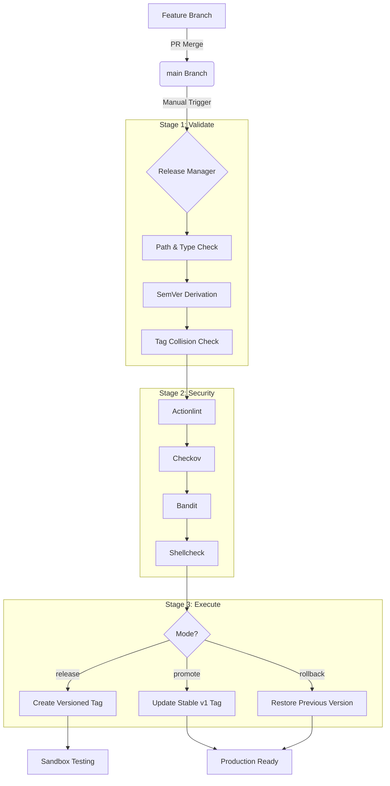
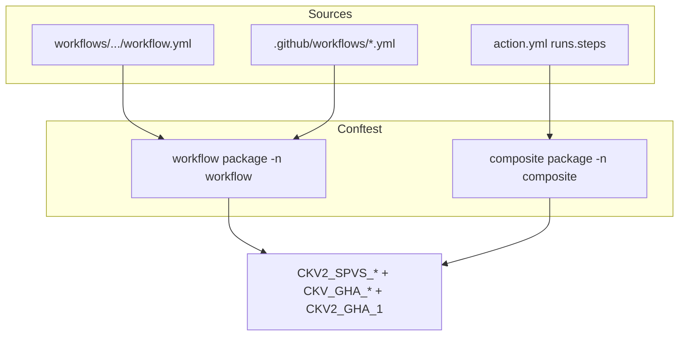

# Monorepo Release Management

This repository implements a robust and secure release management lifecycle for GitHub Actions and Reusable Workflows, aligned with **OWASP SPVS (Secure Pipeline Verification Standard) 1.0**.

## Architecture Overview

The system is designed as a three-stage pipeline (Validate, Security, Execute) that manages the lifecycle of components from a feature branch merge to a stable production release.



## Release Lifecycle

### 1. Release (Sandbox)
- **Trigger**: Run the `Release Manager` workflow with `mode: release`.
- **Behavior**: 
    - Automatically derives the next version based on commit history.
    - Performs full security scans.
    - Creates a versioned tag (e.g., `janitor-bot-1.0.0`).
    - For workflows, it automatically syncs the file to `.github/workflows/`.
- **Purpose**: Provides a versioned artifact for testing in sandbox environments.

### 2. Promote (Production)
- **Trigger**: Run the `Release Manager` workflow with `mode: promote`.
- **Behavior**:
    - Skips security scans (assumes they passed during release).
    - Updates the stable tag (e.g., `janitor-bot-v1`) to point to the selected versioned tag.
    - Uses a secure "delete-and-recreate" approach for tags (no force-push).
- **Purpose**: Marks a specific version as the stable production release.

### 3. Rollback
- **Trigger**: Run the `Release Manager` workflow with `mode: rollback`.
- **Behavior**:
    - Identifies the previous versioned tag in the history.
    - Updates the stable tag (`v1`) to point to that previous version.
    - For workflows, it restores the previous version of the file in `.github/workflows/` on the `main` branch.
- **Purpose**: Quickly reverts to a known good state in case of production issues.

## Commit Message Format

Every commit subject must start with a **ticket reference**, followed by a **Conventional Commit** keyword. This is enforced locally via the global **`commit-msg` shell hook** (`validate_commit_message.sh`) and drives **SemVer** in the Release Manager.

### Ticket prefix (required)

| Pattern | Example |
| :--- | :--- |
| `sctask<number>` | `sctask9876543 feat: add cleanup rule` |
| `inc<number>` | `INC0012345 fix: resolve null pointer` |
| `DCDT-<number>` | `DCDT-12345 chore: update dependencies` |

Ticket matching is case-insensitive (`SCTASK`, `inc`, `dcdt-` are all valid). An optional colon may follow the ticket (`DCDT-1234: feat ...`).

### Subject formats (four supported patterns)

| # | Format | Example |
| :--- | :--- | :--- |
| 1 | `TICKET keyword(scope): message` | `DCDT-1234 feat(release): add hook` |
| 2 | `TICKET: keyword(scope) message` | `SCTASK99: fix(janitor) correct path` |
| 3 | `TICKET: keyword() message` | `INC42: feat() add capability` |
| 4 | `TICKET keyword(): message` | `DCDT-1234 fix(): resolve null pointer` |

Scope is optional in all patterns (`keyword:` and `keyword()` are valid).

### Standard keywords (required after ticket)

| Keyword | Definition | SemVer bump |
| :--- | :--- | :--- |
| `feat` | A new feature for the user or the codebase. | **Minor** |
| `fix` | A bug fix. | **Patch** |
| `chore` | Changes that do not affect source or test files (e.g. dependencies, build process). | **Patch** |
| `docs` | Changes to documentation only. | **None** |
| `refactor` | Code changes that neither fix a bug nor add a feature. | **None** |
| `perf` | Code changes that improve performance. | **None** |
| `test` | Adding missing tests or correcting existing tests. | **None** |
| `style` | Changes that do not affect code meaning (whitespace, formatting, etc.). | **None** |

> **Note**: If no `feat`, `fix`, or `chore` commits exist since the last tag, release fails to prevent empty version bumps. Merge commits (`Merge branch ...`) are exempt from the hook.

## Repository structure

Reusable components are organized so Release Manager, Conftest scans, and pre-commit hooks can resolve paths consistently.

| Path | Type | Required files |
| :--- | :--- | :--- |
| `actions/{category}/{name}/` | Composite GitHub Action | `action.yml` (or `action.yaml`), **`readme.md`**, optional `.sh` / `.py` helpers |
| `workflows/{category}/{name}/` | Reusable workflow | **One** `workflow.yml` (or `.yaml`), **`readme.md`** |
| `policies/conftest/github_actions/` | Conftest Rego policies | `workflow/` and `composite/` packages (`CKV2_SPVS_*`, `CKV_GHA_*`) |
| `.github/workflows/` | Repository CI + synced workflows | e.g. `release-manager.yml`; workflow releases sync to `{name}.yml` |

Naming conventions and `readme.md` template: [Chapter 2 — Writing components](docs/02-writing-components.md#naming-standards).

To author a new action or workflow and test it locally, see the **[SPVS Developer Guide](docs/README.md)** (start at [Chapter 2](docs/02-writing-components.md)).

---

## Security policies (SPVS + Conftest)

This repository enforces **OWASP SPVS (Secure Pipeline Verification Standard) 1.0** at the **Integrate** and **Release** lifecycle stages through automated YAML and code analysis. Policies are expressed as [Conftest](https://www.conftest.dev/) Rego under `policies/conftest/github_actions/` and run locally (pre-commit), in Release Manager (`mode: release`), and via `policies/scripts/conftest-gha.sh`.

### What is enforced where

| Control area | Enforced in GHA YAML (Conftest) | Enforced elsewhere |
| :--- | :---: | :--- |
| Job permissions, shell hardening, action pinning | Yes | — |
| Commit message format / SemVer | — | `commit-msg` hook, Release Manager validate stage |
| PR reviews, signed commits, force-push, CODEOWNERS | — | GitHub branch protection / repo settings |
| Python/shell code quality | — | Bandit / Shellcheck (pre-commit + Release Manager) |
| Workflow syntax | — | Actionlint |

**21 rules** are enabled: `CKV2_SPVS_1`–`15`, `CKV_GHA_1`–`4`, and `CKV2_GHA_1`. Any finding fails the scan (no soft-fail).

### How components are scanned

Conftest scans YAML **in place** — no filesystem staging. Workflows use namespace `-n workflow`; composite actions use `-n composite`. The wrapper [`policies/scripts/conftest-gha.sh`](policies/scripts/conftest-gha.sh) discovers files under `actions/`, `workflows/`, `.github/workflows/`, and `.github/actions/`.



### Scan tooling (Release Manager Stage 2 + local hooks)

| Tool | Scope | Purpose |
| :--- | :--- | :--- |
| **Conftest** | Workflow and composite YAML in repo paths | SPVS Rego policies + selected GHA checks |
| **Actionlint** | Workflow YAML syntax and semantics | Invalid workflows, deprecated expressions, runner issues |
| **Bandit** | Changed `*.py` in components and `policies/scripts/` | Python security anti-patterns (`eval`, `shell=True`, etc.) |
| **Shellcheck** | Changed `*.sh` | Shell bugs, quoting, portability, common injection patterns |

Local runs are **change-scoped** (only touched paths) unless a change under `policies/conftest/` triggers a full rescan. Release **`mode: release`** always runs the full security job on the selected component.

Install tooling: `bash policies/scripts/install_hooks.sh`

---

### Custom policies (`CKV2_SPVS_1` – `CKV2_SPVS_15`)

Each rule is implemented in Rego under [`policies/conftest/github_actions/`](policies/conftest/github_actions/). Below: ID, Rego location, intent, and how to comply.

#### IAM and permissions

| ID | Rego | What it enforces | How to comply |
| :--- | :--- | :--- | :--- |
| **CKV2_SPVS_1** | `workflow/permissions.rego` | Every **job** must declare an explicit `permissions:` block. | Add least-privilege permissions per job; do not rely on implicit `GITHUB_TOKEN` defaults. |
| **CKV2_SPVS_8** | `workflow/permissions.rego` | Jobs using AWS/Azure/GCP OIDC login actions must grant `id-token: write`. | Set `permissions.id-token: write` on jobs that use `configure-aws-credentials`, `azure/login`, or `google-github-actions/auth`. |
| **CKV2_SPVS_9** | `workflow/permissions.rego` | Workflow must declare top-level `permissions`; must not grant **write** on `contents`, `packages`, `id-token`, `security-events`, or `deployments` at workflow level. | Default to read-only at workflow root; grant write only on specific jobs that need it. |
| **CKV2_SPVS_10** | `workflow/permissions.rego` | No `write-all` at workflow or job level (scalar or per-scope). | Never use `permissions: write-all` or `contents: write-all`; enumerate scopes explicitly. |
| **CKV2_SPVS_11** | `workflow/permissions.rego` | Jobs with `permissions.contents: write` must declare a GitHub **`environment:`**. | Add `environment: sandbox` (or production env) to jobs that push, tag, or mutate repo content. |
| **CKV2_SPVS_15** | `workflow/permissions.rego` | Workflows must not use the `pull_request_target` trigger. | Use `pull_request` with explicit permissions; avoid fork PR secret exposure patterns. |

#### Supply chain and shell execution

| ID | Rego | What it enforces | How to comply |
| :--- | :--- | :--- | :--- |
| **CKV2_SPVS_2** | `workflow/steps.rego`, `composite/steps.rego` | Every bash `run:` block must contain `set -euo pipefail`. | First line of each shell script block; applies to composite action steps. |
| **CKV2_SPVS_3** | `workflow/steps.rego`, `composite/steps.rego` | No `set -x`, `set -o xtrace`, or xtrace in `run:` blocks. | Use structured logging (`echo "::notice::"`, prefixed helpers) instead of xtrace. |
| **CKV2_SPVS_4** | `workflow/steps.rego`, `composite/steps.rego` | Any step that invokes `python`/`python3` must use `-u` or `PYTHONUNBUFFERED=1`. | `python -u script.py` or step-level `env: PYTHONUNBUFFERED: "1"`. |
| **CKV2_SPVS_5** | `workflow/steps.rego`, `composite/steps.rego` | Third-party `uses:` refs must pin to a **40-character commit SHA**, use `./` same-repo paths, `docker://`, or approved **internal** `/actions/` tags. | `actions/checkout@<sha> # v6.0.2`; monorepo refs like `org/repo/actions/name@v1` per regex in policy. |
| **CKV2_SPVS_5B** | `workflow/steps.rego`, `composite/steps.rego` | Local action refs must not start with `../`. | Use `./.github/actions/name` or pinned remote refs; skip with `# spvs:skip=CKV2_SPVS_5,CKV2_SPVS_5B: reason` (both IDs — see note below). |
| **CKV2_SPVS_6** | `workflow/steps.rego`, `composite/steps.rego` | `${{ inputs.* }}`, `${{ github.event.inputs.* }}`, and mistaken `inputs.*` shell refs must not appear inside `run:` strings. | Map to `env:` (e.g. `MESSAGE: ${{ inputs.message }}`) and reference `"${MESSAGE}"` in shell. |
| **CKV2_SPVS_13** | `workflow/steps.rego`, `composite/steps.rego` | No `curl\|bash`, `wget\|sh`, or `bash <(curl …)` installers. | Download to file, verify checksum, or use apt/brew/cached binaries (see `install_hooks.sh`). |
| **CKV2_SPVS_14** | `workflow/steps.rego`, `composite/steps.rego` | `${{ github.* }}` and `${{ steps.* }}` must not appear inside `run:` strings. | Map context values to `env:` before the `run:` block (prevents injection and audit gaps). |

#### Credentials and runners

| ID | Rego | What it enforces | How to comply |
| :--- | :--- | :--- | :--- |
| **CKV2_SPVS_7** | `workflow/steps.rego`, `composite/steps.rego` | Step `env` must not contain static cloud credential variables. | Blocked keys include `AWS_ACCESS_KEY_ID`, `AWS_SECRET_ACCESS_KEY`, `AWS_SESSION_TOKEN`, `GCP_SERVICE_ACCOUNT_KEY`, `GOOGLE_APPLICATION_CREDENTIALS`, `AZURE_CLIENT_SECRET`, `ARM_CLIENT_SECRET`. Use OIDC federation instead. |
| **CKV2_SPVS_12** | `workflow/permissions.rego` | `runs-on: self-hosted` (bare label) is prohibited. | Use `ubuntu-latest` or self-hosted labels that indicate ephemeral runners (not the bare string `self-hosted`). |

---

### Official GHA checks (Rego port)

These upstream Checkov rules are ported to Rego alongside custom SPVS rules:

| ID | Rego | Typical focus |
| :--- | :--- | :--- |
| **CKV_GHA_1** | `workflow/steps.rego`, `composite/steps.rego` | Do not set `ACTIONS_ALLOW_UNSECURE_COMMANDS` |
| **CKV_GHA_2** | `workflow/steps.rego`, `composite/steps.rego` | User-controlled GitHub context must not appear in `run:` (shell injection) |
| **CKV_GHA_3** | `workflow/steps.rego`, `composite/steps.rego` | Suspicious use of curl with secrets |
| **CKV_GHA_4** | `workflow/steps.rego`, `composite/steps.rego` | Suspicious netcat reverse-shell patterns |
| **CKV2_GHA_1** | `workflow/permissions.rego` | Top-level `permissions` must not be `write-all` |

Custom `CKV2_SPVS_*` policies extend and specialize these rules for this monorepo (internal action tag patterns, env-mapping for inputs/context, etc.).

---

### SPVS lifecycle mapping

| SPVS stage | This repository |
| :--- | :--- |
| **Plan / Develop** | Commit-msg hook; conventional commits with ticket IDs; SemVer derivation |
| **Integrate** | Pre-commit Conftest, Actionlint, Bandit, Shellcheck on changed paths |
| **Release** | Release Manager `security` job; versioned tags; workflow sync to `.github/workflows/` |
| **Operate** | Promote / rollback modes; stable `v1` tags; branch protection and GitHub App bypass documented in prerequisites |

Repository and branch controls (PR reviews, signed commits, force-push blocks, CODEOWNERS) are **not** expressed in workflow YAML—they must be configured in GitHub settings.

#### Inline policy skips (workflow YAML)

Conftest does not natively honor inline skip comments. This repo post-filters findings in [`conftest-gha.sh`](policies/scripts/conftest-gha.sh) (pre-commit hook and Release Manager). **Do not use raw `conftest test`** if you rely on skips — always scan through `conftest-gha.sh`.

```yaml
uses: ../other-action  # spvs:skip=CKV2_SPVS_5,CKV2_SPVS_5B: monorepo layout; see readme.md
# spvs:skip=CKV_GHA_1: file-level exception
```

Legacy `# checkov:skip=` prefix is also accepted.

| Requirement | Detail |
| :--- | :--- |
| **Scan command** | `bash policies/scripts/conftest-gha.sh` or `bash policies/scripts/conftest-gha.sh -d actions/common/semver` |
| **Tooling** | Conftest v0.56.0 via `bash policies/scripts/install_hooks.sh` |
| **Multiple checks** | List every check ID that fires on that line, comma-separated |
| **Justification** | Document the reason in the component `readme.md` |

---

### Policy maintenance

| Task | Location |
| :--- | :--- |
| Add or change a rule | Edit Rego under `policies/conftest/github_actions/{workflow,composite}/` |
| Add unit test | `workflow_test.rego` or `composite_test.rego` — run `conftest verify -p …` |
| Validate policy change impact | Changes under `policies/conftest/` trigger **full rescan** in pre-commit; run `pre-commit run --all-files` |
| Run all policy tests | `bash policies/tests/run_tests.sh` |
| Reference compliant YAML | [`actions/common/semver/action.yml`](actions/common/semver/action.yml), [`workflows/common/dummy-workflow/workflow.yml`](workflows/common/dummy-workflow/workflow.yml) |

Known gaps and remediation tracking: [Chapter 5 — Release checklist](docs/05-release-checklist.md#4-security-tool-verification).

## Prerequisites

1. **GitHub App**: A GitHub App must be configured with `contents: write` and `workflows: write` permissions.
2. **Secrets**: The following secrets must be added to the repository:
    - `RELEASE_APP_ID`: The Client ID of the GitHub App.
    - `RELEASE_APP_PRIVATE_KEY`: The private key of the GitHub App.
3. **Branch Protection**: If the `main` branch is protected, the GitHub App must be added to the **"Allow bypass"** list to enable automated workflow syncing.

## Local development

**[SPVS Developer Guide](docs/README.md)** — book-style handbook:

| Chapter | Topic |
| :--- | :--- |
| [1. Introduction](docs/01-introduction.md) | Repository map and reading order |
| [2. Writing components](docs/02-writing-components.md) | Author actions and workflows |
| [3. Git hooks](docs/03-dev-hooks.md) | Install and use local hooks |
| [4. Local testing](docs/04-local-testing.md) | Unit tests, Conftest scans, pre-commit |
| [5. Release checklist](docs/05-release-checklist.md) | Release Manager E2E verification |
