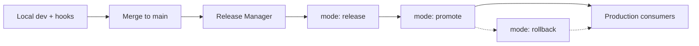

# Chapter 1 — Introduction

> **Part I — Orientation**

This chapter orients you to the monorepo: what it contains, how releases work, and where security policies are defined. Detailed policy rules live in the [repository README](../README.md#security-policies-spvs--conftest); this book focuses on **how to work** in the repo day to day.

---

## What this repository is

`gha-reusable-actions-workflows` is a **monorepo** for:

- **Composite actions** under `actions/{category}/{name}/`
- **Reusable workflows** under `workflows/{category}/{name}/`
- **SPVS security policies** under `policies/conftest/github_actions/`
- **Release automation** via `.github/workflows/release-manager.yml`

Every component follows the same lifecycle: develop on `main` → **release** (versioned tag + security scans) → **promote** (stable `v1` tag) or **rollback**.



For the full pipeline diagram and stage descriptions, see [README — Architecture Overview](../README.md#architecture-overview).

---

## Repository layout

| Path | Purpose |
| :--- | :--- |
| `actions/common/semver/` | Reference **composite action** (`action.yml` + `readme.md`) |
| `workflows/common/dummy-workflow/` | Reference **reusable workflow** (`workflow.yml` + `readme.md`) |
| `.github/workflows/dummy-workflow.yml` | Synced copy produced by Release Manager on workflow release |
| `.github/workflows/release-manager.yml` | Validate → Security → Release / Promote / Rollback |
| `policies/conftest/github_actions/` | Conftest Rego policies (`workflow/`, `composite/`) |
| `policies/scripts/` | `conftest-gha.sh`, `install_hooks.sh`, pre-commit hook entrypoints |
| `policies/tests/` | Shell unit tests for policy runner and commit-msg helpers |
| `requirements-dev.txt` | Python tools for local hooks (`pre-commit`, `bandit`) |

Component paths must match `actions/{category}/{name}` or `workflows/{category}/{name}` so hooks and Release Manager can resolve them.

---

## Security model (summary)

Enforcement happens in three layers:

| Layer | What runs | When |
| :--- | :--- | :--- |
| **Local hooks** | Conftest, Actionlint, Bandit, Shellcheck, commit-msg validation | Every commit (changed paths) |
| **Release Manager** | Full security job on selected component | `mode: release` |
| **GitHub settings** | Branch protection, reviews, signed commits | Repository configuration (not in YAML) |

The README documents every **CKV2_SPVS_*** and **CKV_GHA_*** policy with compliance guidance. When authoring YAML, start with the reference components in [Chapter 2](02-writing-components.md).

---

## Commit messages and SemVer

All commit subjects require a **ticket prefix** and **conventional keyword** (`feat`, `fix`, `chore`, etc.). This is enforced by the `commit-msg` hook and drives version bumps in Release Manager.

Examples:

```text
DCDT-1234 feat(scope): add new capability
SCTASK99: fix(janitor) correct path
INC42: feat() add capability
```

Full rules: [README — Commit Message Format](../README.md#commit-message-format).

---

## Reading order

| Step | Chapter | Goal |
| :---: | :--- | :--- |
| 1 | [Chapter 3 — Git hooks](03-dev-hooks.md) | Run `install_hooks.sh`, enable pre-commit |
| 2 | [Chapter 2 — Writing components](02-writing-components.md) | Author SPVS-compliant YAML |
| 3 | [Chapter 4 — Testing](04-local-testing.md) | Run scans and unit tests locally |
| 4 | [Chapter 5 — Release checklist](05-release-checklist.md) | Verify Release Manager in GitHub Actions |

---

**Navigation:** [Contents](README.md) | [Next: Writing components →](02-writing-components.md)
