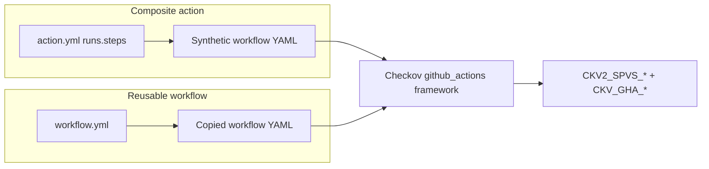

# Chapter 2 — Writing Actions and Workflows

> **Part II — Authoring**

This chapter explains how to add a **composite action** or **reusable workflow**, comply with SPVS policies, and test your component before release.

Policy definitions: [README — Security policies](../README.md#security-policies-spvs--checkov). Local scans: [Chapter 4 — Testing](04-local-testing.md).

---

## Repository layout

Components live under predictable paths so Release Manager, Checkov staging, and pre-commit hooks can find them.

```text
gha-reusable-actions-workflows/
├── actions/
│   └── {category}/          # e.g. common, security
│       └── {name}/          # e.g. semver, prbot
│           ├── action.yml   # required (or action.yaml)
│           ├── readme.md    # required — usage guide for this action
│           ├── *.sh         # optional helper scripts
│           └── *.py         # optional helper scripts
├── workflows/
│   └── {category}/
│       └── {name}/
│           ├── workflow.yml # required — exactly one YAML per directory
│           └── readme.md    # required — usage guide for this workflow
├── policies/
│   └── github_actions/      # Checkov custom policies (CKV2_SPVS_*)
└── .github/workflows/       # repo CI + synced workflow deploy copies
```

| Path pattern | Component type | Release artifact |
| :--- | :--- | :--- |
| `actions/{category}/{name}` | Composite action | Git tag `{name}-{X.Y.Z}` and stable `{name}-v1` |
| `workflows/{category}/{name}` | Reusable workflow | Same tagging; YAML synced to `.github/workflows/{name}.yml` on release |

**Reference implementations** (pass all SPVS checks):

- Action: [`actions/common/semver/`](../actions/common/semver/) — `action.yml` + `readme.md`
- Workflow: [`workflows/common/dummy-workflow/`](../workflows/common/dummy-workflow/) — `workflow.yml` + `readme.md`

---

## Naming standards

Consistent naming keeps Release Manager, git tags, Checkov staging, and consumer references aligned. **Release Manager derives `safe_name` from the component directory basename** (`basename` of `actions/.../name` or `workflows/.../name`).

### Path and directory names

| Element | Rule | Valid examples | Invalid examples |
| :--- | :--- | :--- | :--- |
| **Root** | Must start with `actions/` or `workflows/` | `actions/common/prbot` | `src/prbot`, `action/prbot` |
| **Category** | Lowercase **kebab-case**; logical grouping | `common`, `security`, `release` | `Common`, `release_ops` |
| **Component `{name}`** | Lowercase **kebab-case**; short and descriptive | `janitor-bot`, `dummy-workflow`, `semver` | `JanitorBot`, `dummy_workflow`, `v2` |
| **Characters** | `a–z`, `0–9`, hyphens only | `git-path-filter` | `my.action`, `bot/` |
| **Depth** | Exactly three path segments after repo root | `actions/common/prbot` | `actions/prbot` (missing category) |

The **category** is not part of git tags or synced workflow filenames—only `{name}` (the directory basename) is used for tags and `.github/workflows/{name}.yml`.

### Action naming

| Field | Rule | Example |
| :--- | :--- | :--- |
| Directory | `actions/{category}/{name}` | `actions/common/prbot` |
| Manifest | `action.yml` (preferred) or `action.yaml` | `action.yml` |
| `name:` in `action.yml` | Human-readable title (Title Case) | `'PR Bot'` |
| `description:` | One line; what the action does | `'Create or re-use a pull request idempotently'` |
| Helper scripts | **snake_case** matching purpose | `prbot.py`, `run-dependency-check.sh` |
| Git tags | `{name}-{semver}` / stable `{name}-v1` | `prbot-1.2.0`, `prbot-v1` |

### Workflow naming

| Field | Rule | Example |
| :--- | :--- | :--- |
| Directory | `workflows/{category}/{name}` | `workflows/common/dummy-workflow` |
| Source YAML | **Exactly one** file: `workflow.yml` (preferred) or `workflow.yaml` | `workflow.yml` |
| `name:` in YAML | Human-readable workflow title | `Dummy Reusable Workflow` |
| Job IDs (`jobs.<id>`) | **snake_case** | `echo_message`, `security_scan` |
| Job display `name:` | Title Case | `Echo Message` |
| Step `name:` | Title Case; verb-first | `Calculate Next Version` |
| Synced deploy file | `.github/workflows/{name}.yml` (set by Release Manager) | `.github/workflows/dummy-workflow.yml` |
| Git tags | `{name}-{semver}` / stable `{name}-v1` | `dummy-workflow-1.0.0`, `dummy-workflow-v1` |

```text
Source (authoring)                    Deploy (after release)
─────────────────────                   ──────────────────────
workflows/common/dummy-workflow/        .github/workflows/
  workflow.yml          ──release──►     dummy-workflow.yml
  readme.md
```

**Rules enforced by Release Manager:**

- Only **one** `.yml`/`.yaml` file in a workflow component directory (multiple files fail validation).
- `component_path` input must match `actions/...` or `workflows/...` exactly.
- Workflow release copies source YAML to `.github/workflows/{name}.yml` where `{name}` is the directory basename—not the source filename.

### Consumer references

When calling released components from other repositories:

```yaml
# Internal monorepo action (allowed tag patterns per CKV2_SPVS_5)
uses: my-org/gha-reusable-actions-workflows/actions/common/semver@v1

# Reusable workflow
uses: my-org/gha-reusable-actions-workflows/.github/workflows/dummy-workflow.yml@v1
```

Pin third-party actions in YAML to **40-character SHAs**; internal `/actions/` paths may use stable or semver tags as defined in [CKV2_SPVS_5](../policies/github_actions/PinActionsToSha.yaml).

---

## Component documentation (mandatory `readme.md`)

Every action and workflow **must** include a **`readme.md`** (lowercase) in the component directory before merge. This is the usage guide for consumers and reviewers.

### Filename

| Required | Not accepted |
| :--- | :--- |
| `readme.md` | `README.md`, `Readme.md`, `docs.md` |

Standardize existing components on `readme.md` (one file per component directory).

### Required sections

Use this outline. Omit sections that do not apply (e.g. skip **Outputs** if none).

```markdown
# {Component display name}

One-paragraph summary of purpose.

## Overview & context

- **Purpose**: …
- **Scope**: action or reusable workflow; what it touches
- **Primary users**: …
- **Success criteria**: …

## Metadata dashboard

| Attribute | Value |
| --- | --- |
| **Owner / Lead** | @team or individual |
| **Service Status** | Alpha / Beta / Production |
| **Repository / Code** | `org/repo/actions/{category}/{name}` or workflow path |
| **Dependencies** | APIs, tools, other actions |
| **Slack / Support** | #channel or ticket queue |

## What it does

Bullet list of behavior.

## Inputs          ← actions: action.yml inputs; workflows: workflow_call inputs

| Input | Required | Default | Description |
| --- | --- | --- | --- |

## Outputs        ← actions only, if any

| Output | Description |
| --- | --- |

## Usage examples

At least one copy-paste YAML example (same-repo and consumer-repo if different).

## Requirements

- Tokens / permissions
- Runners / environments
- Python or system dependencies
```

See [`actions/common/prbot/readme.md`](../actions/common/prbot/readme.md) for a full action example and [`workflows/common/dummy-workflow/readme.md`](../workflows/common/dummy-workflow/readme.md) for a workflow example.

### Checklist before PR

- [ ] `readme.md` present in the component directory
- [ ] All public inputs/outputs documented
- [ ] At least one runnable YAML example
- [ ] Required tokens and permissions listed
- [ ] `component_path` matches naming rules (`actions/{category}/{name}` or `workflows/{category}/{name}`)

---

## Writing a composite action

### 1. Create the directory

```bash
mkdir -p actions/common/my-action
touch actions/common/my-action/readme.md
```

### 2. Add `readme.md` and `action.yml`

Create **`readme.md` first** (see [Component documentation](#component-documentation-mandatory-readmemd)), then add the manifest.

Only **composite** actions are supported for Checkov staging. Docker and Node actions in this repo are out of scope for the standard pipeline.

Minimal compliant skeleton:

```yaml
name: 'My Action'
description: 'Short description of what the action does'
inputs:
  example_input:
    description: 'Example input'
    required: true
outputs:
  example_output:
    description: 'Example output'
    value: ${{ steps.main.outputs.example_output }}

runs:
  using: 'composite'
  steps:
    - name: Run logic
      id: main
      shell: bash
      env:
        EXAMPLE_INPUT: ${{ inputs.example_input }}
      run: |
        set -euo pipefail
        # Use env vars — never ${{ inputs.* }} or ${{ github.* }} in run:
        echo "example_output=done" >> "${GITHUB_OUTPUT}"
```

### 3. Policy checklist for actions

Apply the same rules as workflows (Checkov stages composite `runs.steps` into a synthetic workflow):

| Requirement | Do | Don't |
| :--- | :--- | :--- |
| Shell hardening | Start every `run:` with `set -euo pipefail` | `set -e` only, or omit |
| Inputs / context | Map `${{ inputs.* }}`, `${{ github.* }}`, `${{ steps.* }}` to `env:` | Interpolate `${{ ... }}` inside `run:` strings |
| Permissions | Declare `permissions:` on each job when staged | Rely on implicit defaults |
| Third-party `uses:` | Pin to **40-char SHA** (`owner/repo@abc123…`) | Floating tags like `@v4` for external actions |
| Internal monorepo refs | `org/repo/actions/name@v1` or semver tag | `../` parent paths |
| Python | `python -u script.py` or `PYTHONUNBUFFERED=1` | Unbuffered `python script.py` |
| Installers | apt/brew/cached binaries with checksums | `curl \| bash`, `bash <(curl …)` |
| Secrets / cloud | OIDC (`id-token: write` + cloud login actions) | Static `AWS_*`, `AZURE_*`, GCP key env vars |

### 4. Helper scripts

If the action invokes shell or Python:

- Place scripts beside `action.yml` (e.g. `run.sh`, `helper.py`).
- Shell scripts: `set -euo pipefail`, no `shell=True` in Python subprocess calls.
- Python: run with `python -u` or set `PYTHONUNBUFFERED=1` in step `env:`.
- Local pre-commit runs **Shellcheck** on `*.sh` and **Bandit** on `*.py` when those files change.

---

## Writing a reusable workflow

### 1. Create the directory

```bash
mkdir -p workflows/common/my-workflow
touch workflows/common/my-workflow/readme.md
```

### 2. Add `readme.md` and `workflow.yml`

Create **`readme.md`** documenting `workflow_call` inputs and caller examples, then add **exactly one** workflow file named `workflow.yml` (preferred).

```yaml
name: My Reusable Workflow

permissions:
  contents: read

on:
  workflow_call:
    inputs:
      message:
        description: 'Message to echo'
        required: false
        type: string
        default: 'hello'

jobs:
  main:
    name: Main job
    runs-on: ubuntu-latest
    permissions:
      contents: read
    steps:
      - name: Checkout
        uses: actions/checkout@de0fac2e4500dabe0009e67214ff5f5447ce83dd # v6.0.2

      - name: Echo
        shell: bash
        env:
          MESSAGE: ${{ inputs.message }}
        run: |
          set -euo pipefail
          echo "Message: ${MESSAGE}"
```

### 3. Workflow-specific rules

| Topic | Guidance |
| :--- | :--- |
| **Top-level `permissions`** | Use read-only defaults (`contents: read`). Never `write-all` or workflow-level write scopes ([CKV2_SPVS_9](../policies/github_actions/NoWorkflowLevelWritePermissions.yaml), [CKV2_SPVS_10](../policies/github_actions/NoWriteAllPermissions.yaml)). |
| **Job `permissions`** | Every job must declare its own block ([CKV2_SPVS_1](../policies/github_actions/ExplicitJobPermissions.yaml)). |
| **Write operations** | Jobs with `permissions.contents: write` must set `environment:` ([CKV2_SPVS_11](../policies/github_actions/EnvironmentForSensitiveDeploy.yaml)). |
| **Runners** | Prefer `ubuntu-latest`. Bare `runs-on: self-hosted` is blocked ([CKV2_SPVS_12](../policies/github_actions/EphemeralRunners.yaml)). |
| **Triggers** | Do not use `pull_request_target` ([CKV2_SPVS_15](../policies/github_actions/NoPullRequestTarget.yaml)). |
| **Cloud deploy** | Use OIDC actions + `permissions.id-token: write` ([CKV2_SPVS_8](../policies/github_actions/OidcForCloudActions.yaml)). |

---

## How Checkov sees your component

Checkov does not scan `action.yml` directly. Staging converts components into workflow YAML under a temp `.github/workflows/` tree:



| Component | Staging command | Result |
| :--- | :--- | :--- |
| Action | `stage_component.sh --component-path actions/common/semver` | Synthesized workflow from `runs.steps` |
| Workflow | `stage_component.sh --component-path workflows/common/dummy-workflow` | Copy of `workflow.yml` |
| + repo CI | add `--include-repo-workflows` | Also copies `.github/workflows/*` |

Stage and scan locally:

```bash
source .env
STAGING=$(mktemp -d)
bash policies/scripts/stage_component.sh \
  --component-path actions/common/semver \
  --staging-root "${STAGING}"

checkov -d "${STAGING}" \
  --config-file .checkov.yaml \
  --framework github_actions
```

---

## Testing your component

Follow this order before opening a PR or running Release Manager.

| Step | Action | Chapter |
| :---: | :--- | :--- |
| 0 | Add `readme.md` + follow naming standards | [Chapter 2 — Naming & readme](02-writing-components.md#naming-standards) |
| 1 | `install_dev_hooks.sh` + `source .env` | [Chapter 3](03-dev-hooks.md) |
| 2 | `bash policies/tests/run_tests.sh` (if touching shared libs) | [Chapter 4](04-local-testing.md) |
| 3 | `pre-commit run --all-files` or targeted wrapper | [Chapter 4](04-local-testing.md) |
| 4 | Commit with ticket-prefixed subject | [README — Commit format](../README.md#commit-message-format) |
| 5 | Release Manager `mode: release` on `main` | [Chapter 5](05-release-checklist.md) |

Targeted pre-commit scan:

```bash
bash policies/scripts/pre_commit_spvs_wrapper.sh \
  actions/common/my-action/action.yml \
  actions/common/my-action/run.sh
```

---

## Common failures and fixes

| Checkov ID | Typical mistake | Fix |
| :--- | :--- | :--- |
| CKV2_SPVS_1 | Missing job `permissions` | Add `permissions: { contents: read }` to every job |
| CKV2_SPVS_2 | No `set -euo pipefail` | Add as first line of every bash `run:` block |
| CKV2_SPVS_5 | `@v6` on `actions/checkout` | Pin full SHA; add comment with version |
| CKV2_SPVS_6 / 14 | `${{ inputs.foo }}` in `run:` | Move to `env:` and use `"${FOO}"` in shell |
| CKV2_SPVS_9 / 10 | Workflow-level `contents: write` or `write-all` | Default read at top; write only on specific jobs |
| CKV2_SPVS_11 | Job writes without `environment:` | Add `environment: sandbox` (or appropriate env) |
| CKV2_SPVS_13 | `curl \| bash` installer | Use pinned download + checksum or package manager |

Documented exceptions may use Checkov skip comments **only** with justification (e.g. `CKV2_SPVS_5B` for `../` paths — strongly discouraged).

---

**Navigation:** ← [Introduction](01-introduction.md) | [Contents](README.md) | [Next: Git hooks →](03-dev-hooks.md)
