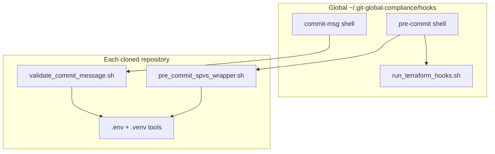

# Chapter 3 — Local Git Hooks

> **Part III — Local development**

Global git hooks are **shell-only** scripts installed to your `core.hooksPath`. They do **not** invoke the Python `pre-commit run` driver on commit. Hook definitions in [`.pre-commit-config.yaml`](../.pre-commit-config.yaml) mirror the same shell entrypoints for optional manual runs.

---

## Architecture



| Global script | Runs |
| :--- | :--- |
| `pre-commit` | Terraform shell checks → SPVS wrapper (if `policies/` exists) |
| `commit-msg` | Strip Cursor trailer → **`validate_commit_message.sh`** |
| `run_terraform_hooks.sh` | `terraform fmt -check`, `validate`, `tflint` on staged `.tf` |

Do **not** run `pre-commit install` in the repo when using global hooks (avoids duplicate `.git/hooks` entries).

---

## What runs on commit

### Pre-commit (shell)

| Check | When | Script |
| :--- | :--- | :--- |
| **Terraform fmt/validate/tflint** | Staged `.tf` / `.tfvars` | `run_terraform_hooks.sh` (global) |
| **SPVS** (Checkov, Shellcheck, Actionlint, Bandit) | Staged paths under `actions/`, `workflows/`, `policies/`, etc. | `pre_commit_spvs_wrapper.sh` |

Skip flags: `SPVS_HOOK_SKIP_CHECKOV=1`, `SPVS_HOOK_SKIP_TERRAFORM=1`.

### Commit-msg (shell)

| Check | Script |
| :--- | :--- |
| Ticket + conventional keyword | `policies/scripts/validate_commit_message.sh` |

Runs on **every commit** in repos that ship `policies/scripts/validate_commit_message.sh`.

---

## Setup

### One-time (per machine)

```bash
git config --global core.hooksPath ~/.git-global-compliance/hooks
mkdir -p ~/.git-global-compliance/hooks
```

### Each clone

```bash
bash policies/scripts/install_dev_hooks.sh
source .env
```

Copies `policies/scripts/global_hooks/*` → global `core.hooksPath` (three shell scripts).

---

## Daily usage

```bash
source .env
git commit -m "DCDT-1234 feat(terraform): add vpc module"
```

---

## Manual runs (shell)

```bash
source .env
bash policies/scripts/global_hooks/run_terraform_hooks.sh
bash policies/scripts/pre_commit_spvs_wrapper.sh path/to/file.yml
bash policies/scripts/validate_commit_message.sh /tmp/commit-msg.txt
```

Optional — same checks via pre-commit framework:

```bash
pre-commit run --all-files
```

---

## Environment variables

| Variable | Default | Effect |
| :--- | :--- | :--- |
| `SPVS_HOOK_VERBOSE` | `0` | Verbose hook output |
| `SPVS_HOOK_SKIP_CHECKOV` | `0` | Skip Checkov in SPVS |
| `SPVS_HOOK_SKIP_TERRAFORM` | `0` | Skip Terraform shell hooks |

---

## Troubleshooting

| Symptom | Fix |
| :--- | :--- |
| Commit-msg not validated | Re-run installer; ensure global `commit-msg` exists |
| `terraform: command not found` | Install Terraform or skip with `SPVS_HOOK_SKIP_TERRAFORM=1` |
| SPVS tools missing | `source .env` |

---

**Navigation:** ← [Writing components](02-writing-components.md) | [Contents](README.md) | [Next: Testing →](04-local-testing.md)
