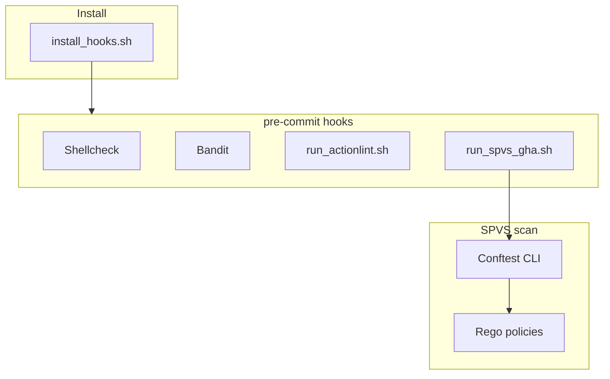

# Chapter 3 — Local Git Hooks

> **Part III — Local development**

This repository uses the [pre-commit](https://pre-commit.com/) framework. Hook definitions live in [`.pre-commit-config.yaml`](../.pre-commit-config.yaml).

---

## Architecture



| Hook | When | Script |
| :--- | :--- | :--- |
| **Shellcheck** | Staged `*.sh` | `shellcheck` |
| **Bandit** | Staged `*.py` | `bandit` |
| **Actionlint** | Workflow YAML under `workflows/`, `.github/workflows/` | `policies/scripts/hooks/run_actionlint.sh` |
| **SPVS GHA** | Changed paths under `actions/`, `workflows/`, `.github/`, `policies/conftest/` | `policies/scripts/hooks/run_spvs_gha.sh` |

The SPVS hook invokes the **Conftest CLI** directly — workflow YAML with `-n workflow`, composite `action.yml` / `action.yaml` with `-n composite` (both policy dirs plus `lib/`).

---

## Setup

### One-time (per machine)

```bash
bash policies/scripts/install_hooks.sh
```

Installs into `~/.venv/bin` (pre-commit, bandit) and `~/.local/bin` (conftest v0.56.0, actionlint).

### Each clone

```bash
pre-commit install
pre-commit install --hook-type commit-msg   # if commit-msg hook is configured
```

---

## Daily usage

```bash
git add .
pre-commit run
git commit -m "DCDT-1234 feat(scope): describe change"
```

Or run all hooks against the full tree:

```bash
pre-commit run --all-files
```

---

## Manual runs

```bash
bash policies/tests/run_tests.sh
bash policies/scripts/hooks/run_actionlint.sh workflows/common/dummy-workflow/workflow.yml
```

---

## Environment variables

| Variable | Default | Effect |
| :--- | :--- | :--- |
| `CONFTEST_BIN` | `conftest` | Path to Conftest binary |

---

## Troubleshooting

| Symptom | Fix |
| :--- | :--- |
| `conftest not found` | Re-run `bash policies/scripts/install_hooks.sh`; ensure `~/.local/bin` is on `PATH` |
| SPVS findings on unchanged files | Policy change under `policies/conftest/` triggers full rescan — expected |
| Actionlint fails on workflow | Fix syntax; see [Chapter 4](04-local-testing.md) |

---

**Navigation:** ← [Writing components](02-writing-components.md) | [Contents](README.md) | [Next: Testing →](04-local-testing.md)
