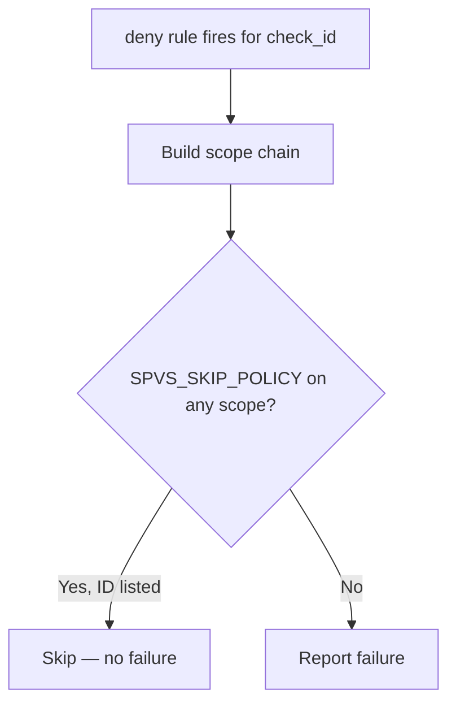

# Chapter 6 — Policy skips (SPVS_SKIP_POLICY)

> **Part II — Authoring**

Use policy skips **only** for documented, reviewed exceptions. Skips are enforced **natively in Rego** — the Conftest CLI reads `SPVS_SKIP_POLICY` / `SPVS_SKIP_REASON` directly from parsed YAML.

```bash
conftest test --parser yaml -n workflow \
  -p policies/conftest/github_actions/workflow \
  -p policies/conftest/github_actions/lib \
  path/to/workflow.yml

conftest test --parser yaml -n composite \
  -p policies/conftest/github_actions/composite \
  -p policies/conftest/github_actions/lib \
  path/to/action.yml
```

---

## YAML implementation

Put the check ID(s) in **`SPVS_SKIP_POLICY`** and the justification in **`SPVS_SKIP_REASON`** in the same `env` block. An adjacent YAML comment is optional for human readers — Rego validates the structured reason field.

### Workflow-level (file-wide)

```yaml
env:
  SPVS_SKIP_POLICY: CKV2_SPVS_5, CKV2_SPVS_5B
  SPVS_SKIP_REASON: monorepo layout; documented in readme.md SEC-1234
permissions:
  contents: read
jobs:
  build:
    runs-on: ubuntu-latest
    permissions:
      contents: read
    steps:
      - uses: ../internal-action
```

### Job-level (all steps in that job)

```yaml
jobs:
  infrastructure-setup:
    runs-on: ubuntu-latest
    permissions:
      contents: read
    env:
      SPVS_SKIP_POLICY: CKV2_SPVS_5B
      SPVS_SKIP_REASON: interim monorepo layout for this job only
    steps:
      - uses: ../legacy-action
      - uses: actions/checkout@de0fac2e4500dabe0009e67214ff5f5447ce83dd
```

### Composite action (root env)

```yaml
name: Example
env:
  SPVS_SKIP_POLICY: CKV2_SPVS_5B
  SPVS_SKIP_REASON: composite monorepo exception
runs:
  using: composite
  steps:
    - uses: ../other-action
```

---

## Scope and inheritance

Skips use **union inheritance**: Conftest checks workflow → job → step (or composite root → step). If **any** scope in the chain lists the check ID, the violation is suppressed.



| Scope | Applies to | Best for |
| :--- | :--- | :--- |
| Workflow `env` | Entire file (all jobs/steps) | Top-level permissions, triggers, file-wide legacy |
| Job `env` | All steps in that job | Job-wide `uses:` / run exceptions |
| Step `env` on `run:` steps | That step only | Rare fine-grained run rule exceptions |
| Step `env` on `uses:` steps | **Avoid** — env is passed into the called action | Use job or workflow scope instead |

### CKV2_SPVS_5 / CKV2_SPVS_5B pairing

Listing **either** ID suppresses **both** for the scoped jobs/steps.

---

## Multiple policies

Use a **comma-separated list** on one line:

```yaml
env:
  SPVS_SKIP_POLICY: CKV2_SPVS_5, CKV2_SPVS_5B, CKV2_SPVS_6
  SPVS_SKIP_REASON: bundled legacy exception; SEC-1234
```

Spaces after commas are trimmed.

---

## Required reason (SPVS_META_1)

Whenever `SPVS_SKIP_POLICY` is set, **`SPVS_SKIP_REASON` must be non-empty in the same `env` block**. Also document the exception in the component **`readme.md`**.

---

## Runtime visibility

`SPVS_SKIP_POLICY` and `SPVS_SKIP_REASON` are **real environment variables** on the GitHub runner when placed in workflow or job `env`. Do not set them on `uses:` steps — they would leak into the called action.

---

## Rego implementation reference

Shared helpers: [`lib/spvs_skip.rego`](../policies/conftest/github_actions/lib/spvs_skip.rego), [`lib/gha_common.rego`](../policies/conftest/github_actions/lib/gha_common.rego)

Each `deny` rule calls `lib.policy_active(check_id, scopes)` before emitting a failure. Meta-policy: [`workflow/skip_meta.rego`](../policies/conftest/github_actions/workflow/skip_meta.rego) (uses `lib.skip_reason_missing`).

---

## Verify locally

```bash
bash policies/tests/test_conftest_env_skip.sh
bash policies/tests/run_tests.sh
```

---

## Checklist before adding a skip

1. Confirm the violation is a **real exception**, not a shortcut.
2. List **every check ID** in `SPVS_SKIP_POLICY` (comma-separated).
3. Set **`SPVS_SKIP_REASON`** in the same `env` block.
4. Document the rationale in the component **`readme.md`**.
5. Prefer **workflow or job `env`** over step `env` on `uses:` steps.

---

**Navigation:** ← [Writing components](02-writing-components.md) | [Contents](README.md) | [Testing →](04-local-testing.md)
